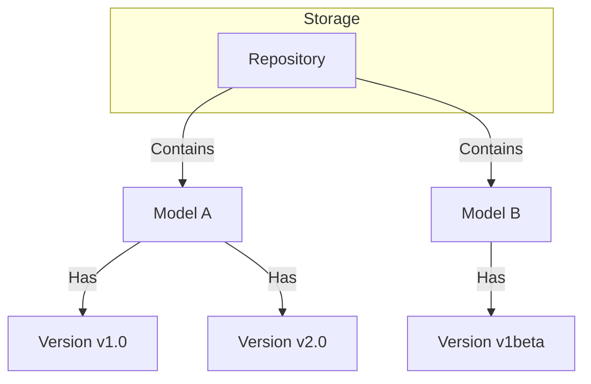
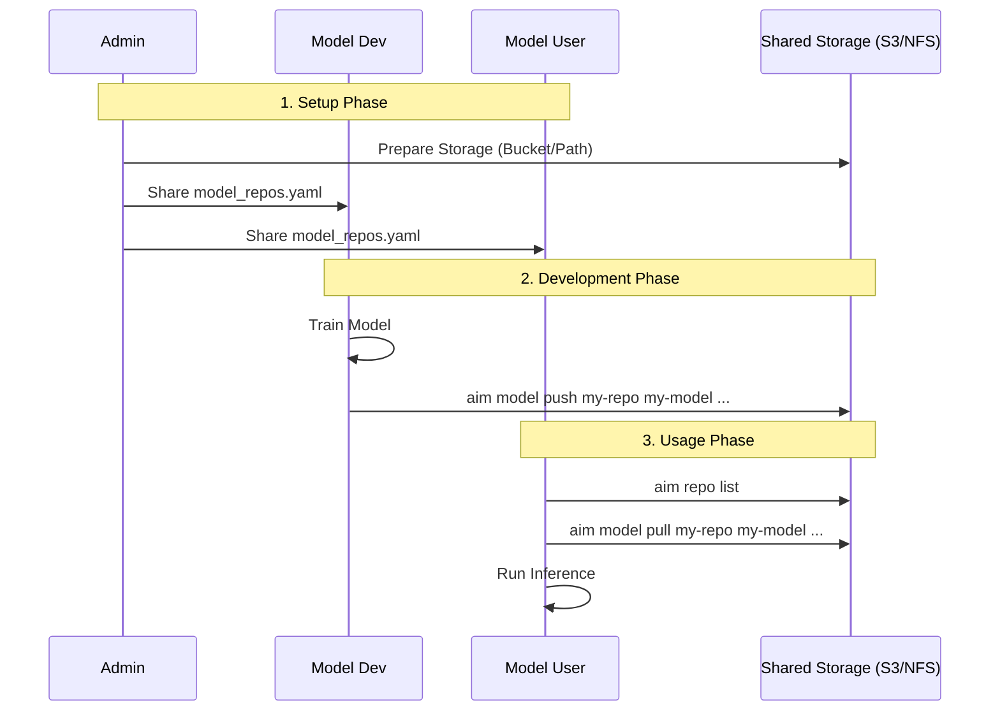

# AIM CLI (AI Model Manager)

[](https://opensource.org/licenses/MIT)
[](https://www.python.org/downloads/release/python-390/)
[](https://github.com/psf/black)

A powerful CLI tool to manage AI model weights using external storage (Local/NFS, S3).  
Designed for private infrastructure, offering a HuggingFace-like experience for your own models.

---

## 📖 Table of Contents
- [Features](#-features)
- [Concepts & Architecture](#-concepts--architecture)
- [Installation](#-installation)
- [Quick Start](#-quick-start)
- [Role-Based Guide](#-role-based-guide)
  - [Admin](#-admin-infrastructure-setup)
  - [Developer](#-developer-model-creator)
  - [User](#-user-model-consumer)
- [Configuration](#-configuration)
- [Development](#-development)
- [License](#-license)

---

## ✨ Features

- **Decentralized Storage**: Support for S3 buckets and Local/NFS paths.
- **Version Control**: Immutable model versions (v1.0, v2.0, etc.).
- **Team Collaboration**: Shareable `model_repos.yaml` configuration.
- **Easy CLI**: Intuitive commands for pushing, pulling, and managing models.
- **Rich Output**: Beautiful terminal output using `rich`.

---

## 🏗 Concepts & Architecture

The tool organizes models in a hierarchical structure:



- **Repository**: A storage location (S3 bucket or NFS path) defined in `model_repos.yaml`.
- **Model**: A named logical entity within a repository.
- **Version**: An immutable snapshot of model weights (directory).

### Collaborative Workflow



---

## 🚀 Installation

### Using `pip`
You can install the CLI directly from the source:

```bash
pip install git+https://github.com/yourusername/aim-cli.git
```

### Using `uv` (Recommended for Dev)
This project uses [uv](https://github.com/astral-sh/uv) for fast package management.

```bash
# Clone the repo
git clone https://github.com/yourusername/aim-cli.git
cd aim-cli

# Sync dependencies
uv sync

# Run directly
uv run aim --help
```

---

## 🎯 Role-Based Guide

### 👩‍💼 Admin (Infrastructure Setup)
Responsible for configuring repositories and sharing the config.

```bash
# 1. Initialize a new repo pointing to S3 bucket
aim repo create team-vision-repo --type s3 --path s3://my-company-ai-models/vision --region us-east-1

# 2. Check the configuration
aim repo list

# 3. Share 'model_repos.yaml' with the team
git add model_repos.yaml
git commit -m "Add vision team model repo"
git push
```

### 👩‍💻 Developer (Model Creator)
Responsible for training models and pushing new versions.

```bash
# 1. Update config (pull latest model_repos.yaml)
git pull origin main

# 2. Push a new model version (v1.0)
# This creates the model entry if it doesn't exist
aim model push team-vision-repo resnet50-finetuned ./checkpoint_v1 --tag v1.0

# 3. Push a subsequent version (v2.0)
aim model push team-vision-repo resnet50-finetuned ./checkpoint_v2 --tag v2.0
```

### 🙋 User (Model Consumer)
Responsible for downloading models for inference or deployment.

```bash
# 1. List available models in the repo
aim model list team-vision-repo

# 2. Check available versions for a specific model
aim model versions team-vision-repo resnet50-finetuned

# 3. Download the specific version needed
aim model pull team-vision-repo resnet50-finetuned ./models/resnet50 --tag v1.0
```

### 🧹 Maintenance
Commands for cleaning up old data.

```bash
# Delete a specific version
aim model delete-version team-vision-repo resnet50-finetuned --tag v1.0

# Delete a model and ALL its versions
aim model delete team-vision-repo resnet50-finetuned

# Delete a repository configuration (does not delete data on cloud)
aim repo delete team-vision-repo
```

---

## ⚙️ Configuration

Configuration is stored in `model_repos.yaml` in the current working directory.
You can share this file with your team via Git to keep everyone in sync.

Example `model_repos.yaml`:
```yaml
repos:
  team-vision-repo:
    type: s3
    path: s3://my-company-ai-models/vision
    region: us-east-1
  local-debug-repo:
    type: local
    path: /tmp/aim-models
```

---

## 🛠 Development

1. **Install uv**: `pip install uv`
2. **Clone & Setup**:
   ```bash
   git clone ...
   cd aim-cli
   uv sync
   ```
3. **Run Tests** (if available):
   ```bash
   uv run pytest
   ```

---

## 📄 License

This project is licensed under the MIT License. See the [LICENSE](LICENSE) file for details.
