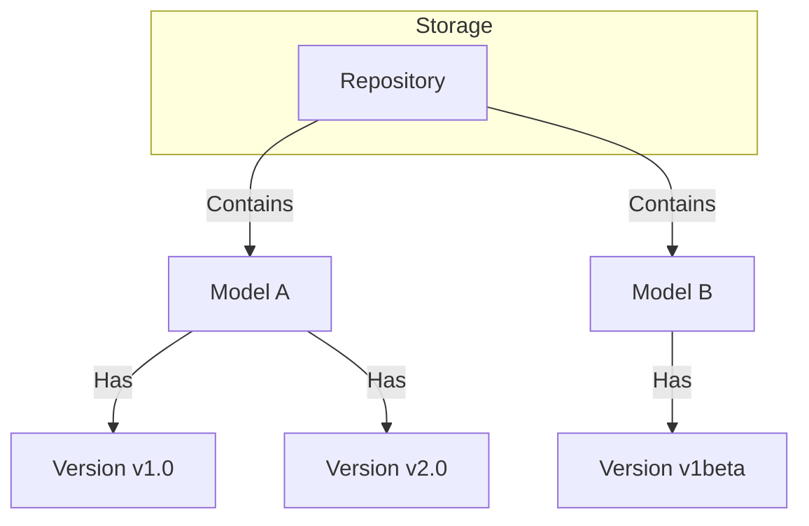
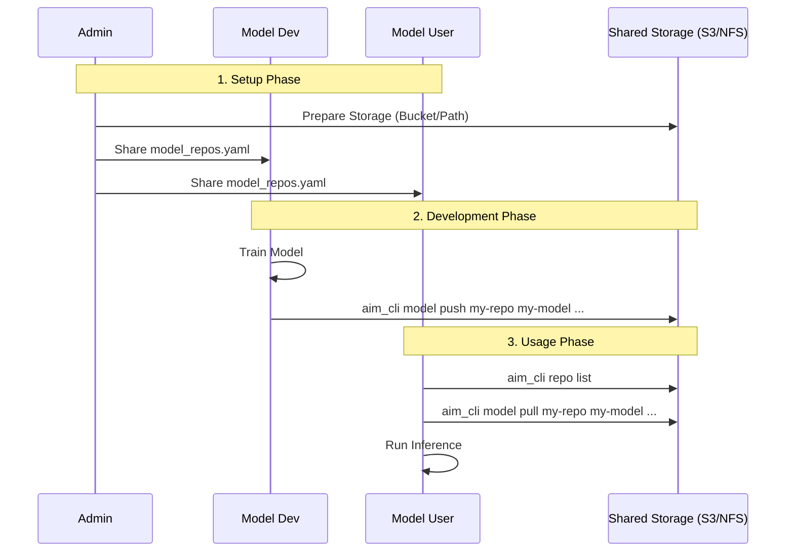

# AIM CLI (AI Model Manager)

A CLI tool to manage AI model weights using external storage (Local/NFS, S3).
Inspired by HuggingFace CLI but for private infrastructure.

## Concepts & Hierarchy

The tool organizes models in a hierarchical structure:



- **Repository**: A storage location (S3 bucket or NFS path) defined in `model_repos.yaml`.
- **Model**: A named logical entity within a repository.
- **Version**: An immutable snapshot of model weights (directory).

## Collaborative Workflow



## Installation & Development

This project uses [uv](https://github.com/astral-sh/uv) for package management.

### Prerequisites
- Install `uv`: `pip install uv` or see [uv docs](https://docs.astral.sh/uv/getting-started/installation/).

### Setup
1. Clone the repository.
2. Sync dependencies (creates virtual environment):
   ```bash
   uv sync
   ```

### Running Commands
You can run the CLI directly using `uv run`:

```bash
uv run aim_cli --help
```

Or activate the virtual environment:

```bash
source .venv/bin/activate
aim_cli --help
```

## Role-Based Usage Guide

### 👩‍💼 Admin (Infrastructure Setup)
Responsible for configuring repositories and sharing the config.

```bash
# 1. Initialize a new repo pointing to S3 bucket
aim_cli repo create team-vision-repo --type s3 --path s3://my-company-ai-models/vision --region us-east-1

# 2. Check the configuration
aim_cli repo list

# 3. Share 'model_repos.yaml' with the team
git commit model_repos.yaml -m "Add vision team model repo"
```

### 👩‍💻 Developer (Model Creator)
Responsible for training models and pushing new versions.

```bash
# 1. Update config (pull latest model_repos.yaml)
git pull origin main

# 2. Push a new model version (v1.0)
# This creates the model entry if it doesn't exist
aim_cli model push team-vision-repo resnet50-finetuned ./checkpoint_v1 --tag v1.0

# 3. Push a subsequent version (v2.0)
aim_cli model push team-vision-repo resnet50-finetuned ./checkpoint_v2 --tag v2.0
```

### 🙋 User (Model Consumer)
Responsible for pulling models for inference or deployment.

```bash
# 1. List available models in the repo
aim_cli model list team-vision-repo

# 2. Check available versions for a specific model
aim_cli model versions team-vision-repo resnet50-finetuned

# 3. Download the specific version needed
aim_cli model pull team-vision-repo resnet50-finetuned ./models/resnet50 --tag v1.0
```

### 🧹 Maintenance & Cleanup
Commands for removing data.

```bash
# Delete a specific version
aim_cli model delete-version team-vision-repo resnet50-finetuned --tag v1.0

# Delete a model and ALL its versions
aim_cli model delete team-vision-repo resnet50-finetuned

# Delete a repository configuration (does not delete actual data on S3/NFS)
aim_cli repo delete team-vision-repo
```

## Usage

Using `uv run`:

```bash
# Check info
uv run aim_cli info

# Create a repo (e.g. NFS)
uv run aim_cli repo create my-repo --type local --path /mnt/nfs/models

# Push a model
uv run aim_cli model push my-repo my-model ./local-model-v1 --tag v1.0

# Pull a model
uv run aim_cli model pull my-repo my-model ./downloaded-model --tag v1.0
```

## Configuration
Configuration is stored in `model_repos.yaml`. You can share this file with your team.
